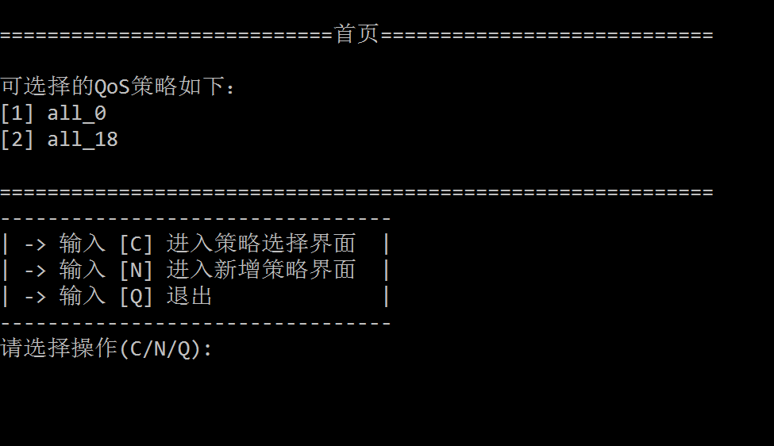
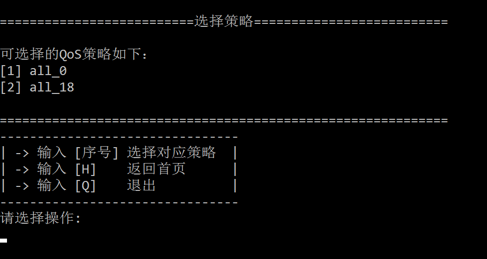
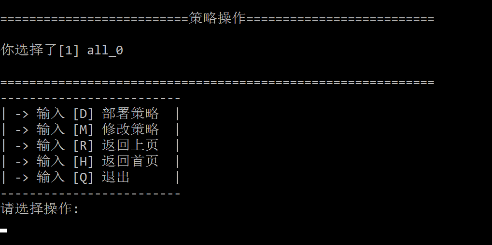
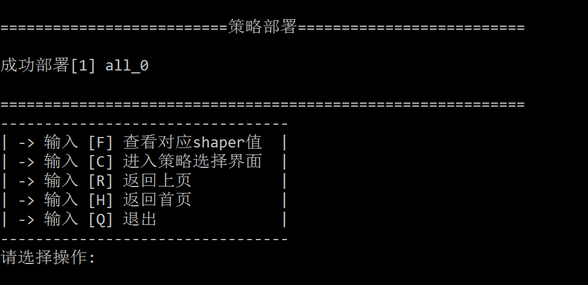
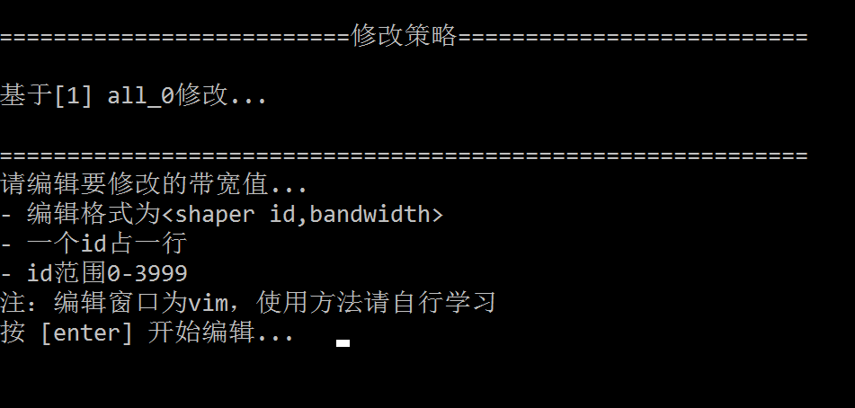
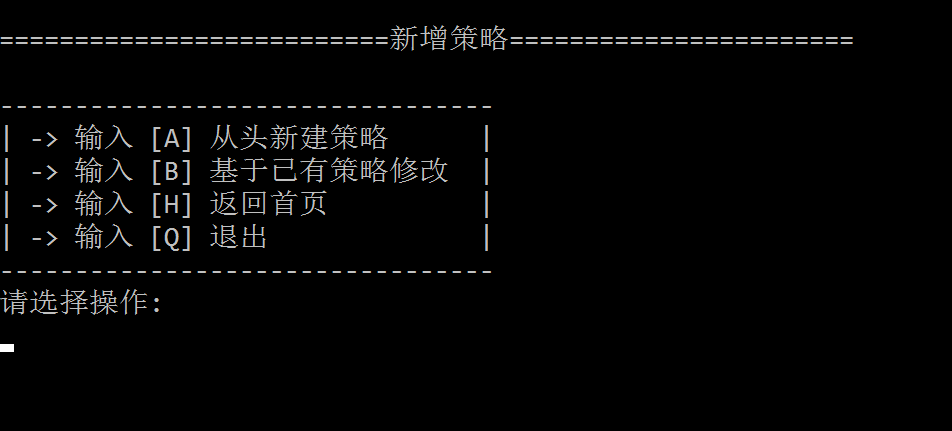

# 后台功能实现

### 新增功能测试模块(`run_test.py`)
- 在控制台实现简单界面效果，方便测试  

#### 说明：
1. 测试方法：  
	- clone [https://github.com/li-tianqi/Qos-Configuration-Tool.git](https://github.com/li-tianqi/Qos-Configuration-Tool.git)，切换到分支`back-end`
	- 或到[https://github.com/li-tianqi/Qos-Configuration-Tool/tree/back-end](https://github.com/li-tianqi/Qos-Configuration-Tool/tree/back-end)下载zip解压
	- 找到根目录下的`run_test.py`, 执行`./run_test.py`或`python3 run_test.py`
2. 操作方法：根据界面提示输入相应选项并回车
3. 所有命令选项不区分大小写

#### 包括的功能
1. 首页
	- 展示已保存的策略
	- 提供到选择策略的界面跳转
	- 提供到新增策略的界面跳转
	- 提供退出功能
	- 显示如下

2. 选择策略
	- 列出可选择的策略和对应序号
	- 根据序号选择对应策略,跳转到操作界面
	- 提供返回首页的跳转
	- 提供退出选项
	- 显示如下

3. 策略操作
	- 显示选中的策略
	- 提供部署策略选项
	- 提供修改策略选项
	- 拟增加删除策略选项
	- 提供返回上页选项
	- 提供返回首页选项
	- 提供退出选项
	- 显示如下

4. 策略部署
	- 显示部署成功的策略
	- 提供查看对应id的pir值的选项（不是带宽值）
	- 提供到选择策略界面的跳转
	- 提供返回上页选项
	- 提供返回首页选项
	- 提供退出选项
	- 显示如下

5. 修改策略
	- 显示选中的策略
	- 提供修改策略向导
	- 显示如下

6. 新增策略
	- 提供从头新建策略的选项
	- 提供基于已有策略创建策略的选项
	- 分别提供对应的向导
	- 提供返回首页选项
	- 提供退出选项

### 功能
1. 修改带宽功能
	- 4000个shaper带宽
	- 上限带宽
2. 读取当前使用规则功能
	- 可以在每次设置完新规则后将新规则存入数据库
	- 也可以在编译阶段同时保存一份同名shaper值文件，用与读取
3. 编译C文件功能
	- 可指定生成文件名
	- 同时保存一份同名shaper值文件
4. 选择并设置QoS规则功能
	- 利用配置shell脚本
5. QoS开关功能
	- 对应shell脚本
	
  
  
# 备注：
---
> # Qos配置工具
> --提供FPGA智能网卡上自动配置QoS规则的功能  
> 
> ### 总体目标
> 修改QoS规则，并使其生效（*目前的QoS规则直接体现为4000个shaper值(还有一个带宽上限值)*）
> 
> ### 当前实现方法
> 通过修改配置文件`dynamic_pf_app.c`中对应的配置代码实现  
> 
> ### 计划实现方法
> 开发一个配置工具，通过web界面的简单操作实现QoS规则的设置
> 
> ### 变更QoS规则的过程
> 1. 修改4000个shaper值和带宽上限值（*每个shaper有自己的id*）
> 2. 重新编译C文件，生成QoS规则文件
> 3. 配置新规则，使其生效
> 
> ### web上应该提供的功能
> 1. 针对不同情况，能方便修改shaper值
	- 所有shaper值设为一样
	- 大部分值一样，少数指定id的不同
	- 通过预先准备的配置文件（*id与带宽值的对应关系*）进行设置
> 2. 能识别当前使用中的规则（*得到当前规则的4000个shaper值*）
> 3. 能在当前规则的基础上进行修改（*修改某几个值*）
> 4. 能设置并保存多种QoS规则（*保存多个编译后的文件*）
> 5. 能方便的选择已保存的规则，使其生效
> 6. 提供总体的QoS开关
